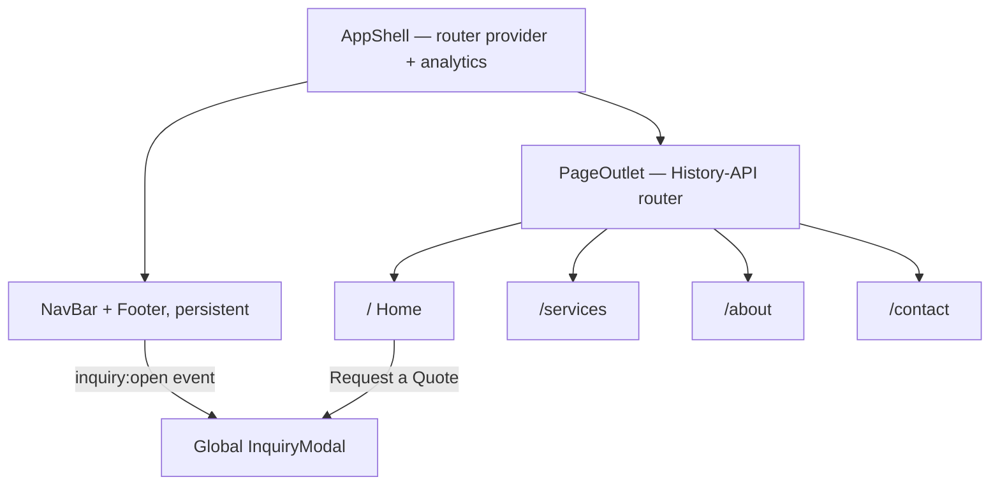

<p align="center">
  <picture>
    <source media="(prefers-color-scheme: dark)" srcset="public/images/DBF-Logo-White.png" />
    
  </picture>
</p>

<h1 align="center">Dickinson Bayou Fleeting</h1>

<p align="center">
  <b>Barge fleeting, marine services, and coastal dock leasing on the upper Texas Gulf Coast.</b>
</p>
<p align="center">
  The marketing and lead-generation site for a two-yard fleeting operation on Galveston Bay and the GIWW.<br />
  Live at <a href="https://dickinsonbayoufleeting.com">dickinsonbayoufleeting.com</a>.
</p>

<p align="center">
  
  
  
  
  
</p>

<br />

## Why Dickinson Bayou Fleeting

Fleeting is a phone-call business, so the site's job is to get a dispatcher to call — fast, from any page, on a phone with one bar out on the dock. That shapes everything: no framework routing, no CSS-in-JS, no cookie banner, and a quote request always one tap away. What is left is a small React bundle over a plain CSS token system.

<table width="100%">
  <tr>
    <td width="50%" valign="top">
      <h3 align="center">Lead capture from anywhere</h3>
      <p align="center">Any button on the site dispatches an <code>inquiry:open</code> window event and the app shell opens the global inquiry modal — triggers stay decoupled from the form.</p>
    </td>
    <td width="50%" valign="top">
      <h3 align="center">No dependency it doesn't need</h3>
      <p align="center">Routing is a hand-rolled History-API router, styling is plain CSS custom properties, and the hero is a procedural Canvas animation — the only runtime dependency is React itself.</p>
    </td>
  </tr>
</table>

<br />

## Stack

| Layer | Technology |
| :--- | :--- |
| UI | React 19 |
| Build & dev | Create React App (`react-scripts` 5) |
| Routing | Custom History-API router in `src/app/router` — no React Router |
| Styling | Plain CSS with the "Tidewater" custom-property token system, colocated per component |
| Theming | Fixed dark page; per-section `[data-surface="light" \| "dark"]` flipping |
| Hero | Canvas 2D procedural ocean-topography animation (reduced-motion and off-screen aware) |
| Analytics | First-party, cookieless beacon (`src/lib/sunday-analyzer`) |
| SEO & PWA | OG / Twitter / geo meta, Schema.org JSON-LD, web manifest and icon set, sitemap, robots |
| Hosting | Vercel |

## Getting started

```bash
npm install
npm start                # CRA dev server at localhost:3000
npm run build            # production build to build/
```

No environment configuration is required — the site has no backend and no API keys. `CI=true npm run build` matches the Vercel build, where warnings fail the build.

### Scripts

| Script | Does |
| :--- | :--- |
| `npm start` | Start the CRA dev server. |
| `npm run build` | Production build to `build/`. |
| `npm test` | Jest runner (no suites committed yet). |
| `npm run eject` | One-way CRA eject. |

There is no lint or format script — this is a Create React App project, not the Vite template the other client sites use.

## Pages

`NavBar`, `Footer`, and the global `InquiryModal` persist across every route.

| Route | Renders |
| :--- | :--- |
| `/` | Hero, services preview, lease rates, amenities, service area, facilities + maps, CTA — with a right-rail `ScrollSpy` |
| `/services` | Seven-service catalog, lease rates, FAQ accordion, CTA |
| `/about` | Company story, values, timeline, service area, CTA |
| `/contact` | Contact form, direct lines, both facility maps |

## Architecture



## How it works

- **The router is three files.** `Router.js`, `Link.js`, and a `routes.js` table drive History-API navigation; React Router is not in the dependency tree.
- **Content lives in constants.** Facilities, services, lease options, FAQ, nav links, service area, and about copy are each a module under `src/app/constants` — the views only render them.
- **Forms are front-end only.** There is no backend, so the inquiry modal and the contact form run a short simulated send and then show a success state with a phone fallback.
- **The hero draws itself.** `OceanTopographyBackground` animates contour bands on a Canvas 2D context, pausing off-screen and honoring `prefers-reduced-motion`.
- **Two yards, one source of truth.** San Leon (2629 Avenue R, Dickinson, TX) at $4,100/month and Freeport (906 Marlin Ln, Freeport, TX) at $4,800/month — both 5-acre waterfront facilities — come from the single `FACILITIES` table that feeds the lease cards, maps, and contact page.

## Project structure

```
dickinsonbayoufleeting-com/
├── public/
│   ├── images/                DBF logo (black/white) + icon
│   ├── index.html             SEO meta, Schema.org JSON-LD, fonts
│   ├── manifest.json          PWA manifest + icon set
│   └── sitemap.xml, robots.txt
└── src/
    ├── index.js               React root, wrapped in SundayAnalyticsProvider
    ├── app/
    │   ├── App.js             AppShell — nav, routed outlet, footer, inquiry modal
    │   ├── router/            History-API router (Router, Link, routes)
    │   ├── constants/         facilities, services, leaseOptions, faq, navLinks, …
    │   ├── hooks/             useReveal, useCountUp, useScrolled
    │   └── styles/            Theme.css tokens + global CSS
    ├── views/                 HomeView, ServicesView, AboutView, ContactView
    ├── components/            Section and UI components (+ colocated styles/)
    └── lib/sunday-analyzer/   First-party cookieless analytics provider
```

## License

Copyright (c) 2026 Trenton Taylor. All rights reserved. See [LICENSE.md](LICENSE.md).

<br />

<p align="center">
  <sub>Built by <a href="https://taylorurl.com">TaylorURL</a> — custom sites for local businesses.</sub>
</p>
