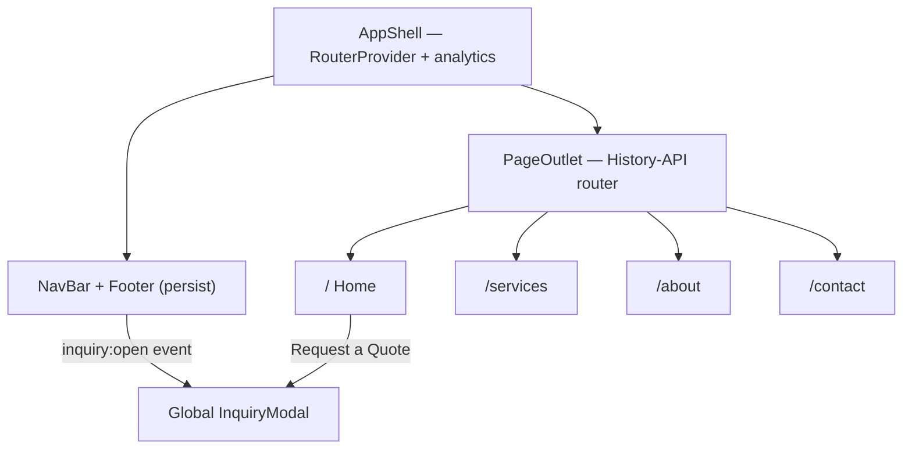

<p align="center">
  <picture>
    <source media="(prefers-color-scheme: dark)" srcset="public/images/DBF-Logo-White.png">
    
  </picture>
</p>

<h1 align="center">Dickinson Bayou Fleeting</h1>

<p align="center">
  Marketing and lead-generation site for a coastal <strong>barge fleeting</strong>, marine services and waterfront dock-leasing company on the upper Texas Gulf Coast.<br>
  Live at <a href="https://dickinsonbayoufleeting.com">dickinsonbayoufleeting.com</a>.
</p>

<p align="center">
  
  
  
  
  
</p>

- **Multi-page React SPA** — Home, Services, About and Contact routes served by a hand-rolled History-API router, with no React Router dependency.
- **"Tidewater" design system** — plain CSS custom-property tokens with per-section light/dark surface flipping and a procedural Canvas ocean-topography hero, no Tailwind and no CSS-in-JS.
- **Lead-capture first** — a global inquiry modal plus a validated, phone-masked, focus-trapped contact form, click-to-call, and live facility maps drive every quote request.

## Stack

| Layer | Choice |
| --- | --- |
| UI framework | React 19.1 |
| Tooling | Create React App (`react-scripts` 5) |
| Routing | Custom History-API router in `src/app/router` — no React Router |
| Styling | Plain CSS with a custom-property token system ("Tidewater"), colocated `.css` per component |
| Theming | Fixed dark page; per-section `[data-surface="light" \| "dark"]` flipping (not `prefers-color-scheme`) |
| Hero | Canvas 2D procedural ocean-topography animation (reduced-motion + off-screen aware) |
| Analytics | First-party, cookieless beacon (`src/lib/sunday-analyzer`) to a hosted ingest endpoint |
| SEO / PWA | OG + Twitter + geo meta, Schema.org JSON-LD, web manifest + full icon set, sitemap, robots |
| Hosting | Vercel |

## Getting started

```bash
npm install
npm start                # CRA dev server at localhost:3000
npm run build            # production build to build/
CI=true npm run build    # verify gate — matches Vercel; warnings fail the build
```

`react-scripts` also exposes `npm test` (Jest runner; no suites committed yet) and the one-way `npm run eject`. There is no lint/format script — this is a Create React App project, not the Vite template used by the other client sites.

## Pages

Client-side routes; `NavBar`, `Footer` and the global `InquiryModal` persist across all of them.

| Route | Page | Renders |
| --- | --- | --- |
| `/` | Home | Hero, services preview, lease rates, amenities, service area, facilities + maps, CTA — with a right-rail `ScrollSpy` |
| `/services` | Services | Seven-service catalog, lease rates, FAQ accordion, CTA |
| `/about` | About | Company story, values, timeline, service area, CTA |
| `/contact` | Contact | Contact form + direct lines, both facility maps |

## Architecture



The inquiry modal is decoupled from its triggers: any button dispatches a `window` `inquiry:open` event and `AppShell` opens the modal. Both the modal and the Contact-page form are front-end only — there is no backend, so a submit runs a short simulated send and shows a success state with a phone fallback.

## Business details

- **Two yards.** San Leon — 2629 Avenue R, Dickinson, TX (Galveston Bay / Houston Ship Channel) and Freeport — 906 Marlin Ln, Freeport, TX (Gulf Intracoastal Waterway). Both are 5-acre waterfront facilities.
- **Lease rates.** Fixed monthly: San Leon $4,100/mo, Freeport $4,800/mo, derived from a single `FACILITIES` source of truth.
- **Services.** Long-term barge fleeting, shifting & handling, vessel mooring & lay berth, cleaning coordination, repair & survey coordination, marine logistics support, and waterfront dock leasing.

## Project structure

```
dickinsonbayoufleeting-com/
├── public/
│   ├── images/            # DBF logo (black/white) + icon
│   ├── index.html         # SEO meta, Schema.org JSON-LD, fonts, analytics beacon
│   ├── manifest.json      # PWA manifest + icon set
│   └── sitemap.xml, robots.txt
├── src/
│   ├── index.js           # React root, wrapped in SundayAnalyticsProvider
│   ├── app/
│   │   ├── App.js         # AppShell: nav, routed outlet, footer, inquiry modal
│   │   ├── router/        # History-API router (Router, Link, routes)
│   │   ├── constants/     # facilities, services, faq, navLinks, about, ...
│   │   ├── hooks/         # useReveal, useCountUp, useScrolled
│   │   └── styles/        # Theme.css tokens + global CSS
│   ├── views/             # HomeView, ServicesView, AboutView, ContactView
│   ├── components/        # section + UI components (+ colocated styles/)
│   └── lib/sunday-analyzer/  # first-party cookieless analytics provider
└── package.json
```

## License

Proprietary — © 2026 Trenton Taylor. All rights reserved. See [`LICENSE.md`](LICENSE.md).

<p align="center"><sub>Built by <a href="https://www.taylorurl.com"><strong>TaylorURL</strong></a></sub></p>
